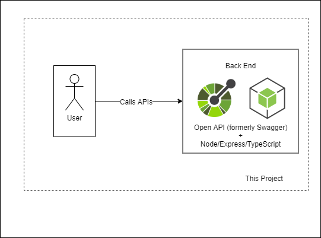
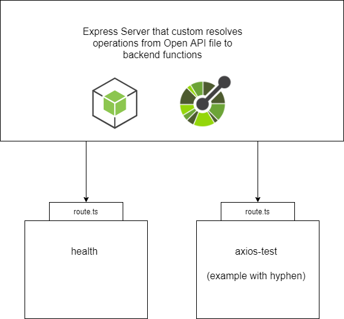

# Penjar - PostgreSQL Express Node Jest Axios React /w Custom Resolved Operation Handlers

Oanete (Pronounced: Oh neat see!) is an Express Node TypeScript project with Custom Resolved Operation Handlers. This project uses an Open API file to describe the API, and ensure the implementation always matches that description. Custom Resolved Operation Handlers, helps developers ensure that all "operations" in the Open API file have a corresponding implementation route.

For Oanete without Custom Resolved Operation Handlers, vheck the following project: https://github.com/NguyenAndrew/Oanete

Useful to watch the following video, to understand the benefits of structuring a project in this format: https://www.youtube.com/watch?v=nfkppuQ-Eg0 - "Phil Sturgeon presents Design First APIs using Stoplight Studio @ PHP South Wales"

## Architecture



## How Custom Resolved Operation Handlers work



## QuickStart - Updating the API
1. Download [Stoplight Studio](https://stoplight.io/studio/) (Note: Either Mac, Windows, or Linux depending on your desktop)
2. Using Stoplight Studio, select "Open Existing Folder", and open up this project's api_documentation folder
3. Edit the API the way you want it to be!
4. Update implementation code to match API (More instructions on running code below)

## QuickStart - Running Locally
1. Navigate to the run_locally directory
2. Open terminal of choice in the run_locally directory
3. Install your dependencies with ```npm install```
5. Run your application with ```npm run start``` (Note: `start:windows`, `start:linux`, and `start:mac` are also available)
6. Ready to Code!

## Quickstart - Import and Calling API with Postman
1. Download [Postman App](https://www.postman.com/downloads/)
2. Open Postman and go to File->Import->File, upload the api file located within this project's ./api_documentation/reference/api.yaml
3. Click import
4. Start calling the API!

## QuickStart - Running on Docker
1. Make sure you are on the root directory
2. Build the docker image: `docker build -t my-penjar-app-image .`
3. Run the image as a docker container: `docker run -p 8080:8080 -it --rm --name my-running-penjar-app-container my-penjar-app-image`

## Quickstart - Editting Diagrams
1. Download [Draw.io Desktop Edition](https://github.com/jgraph/drawio-desktop/releases)
2. In diagrams folder, open architecture.drawio.png in Draw.io Desktop Edition
3. Make changes
4. Click save button!

## Quickstart - Upgrading (Updating) all dependencies
1. Note: This command will update dependencies in the following folders: run_locally, back_end, and front_end
2. Navigate to the run_locally directory
3. Open terminal of choice in the run_locally directory
4. Check which dependencies need to be upgraded with ```npm run dependup:check```
5. Upgrade all dependencies with ```npm run dependup```
6. Upgrade dependencies in your package-lock.json with ```npm install```
7. Optional: Check to see which dependencies were not updated (due to failing tests) with ```npm run dependup:check```